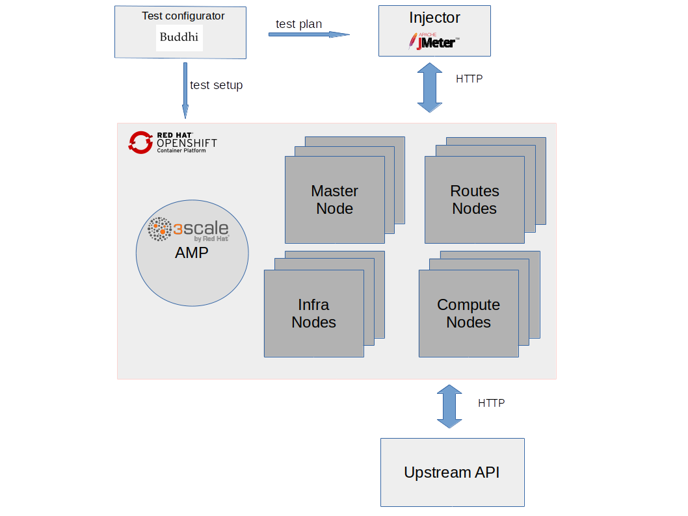

# perftest-toolkit

[](https://quay.io/repository/3scale/perftest-toolkit)
[](https://circleci.com/gh/3scale/perftest-toolkit)

This repo has tools and deployment configs for a performance testing environment to be able to run performance tests of a 3scale API Management solution, focussing on the traffic intensive parts of the solution (the API Gateway and the Service Management API).

We have open sourced it to enable partners, customers and support engineers to run their own performance tests on "self-managed" (i.e. Not SaaS) installations of the 3scale API Management solution.

By running performance test with the same tools, scripts, traffic patterns and measurements as we at 3scale do, we hope it will help produce results that can be more easily compared with the results we achieve in our regular in-house performance testing and that we can run internally.

The goal is to help to resolve doubts or issues related to scalability or performance more quickly and easily - allowing you to achieve the high levels of low-latency performance we strive for and ensure in our own internal testing.

## Table of Contents

* [High level overview](#high-level-overview)
* [Deploy Upstream API (Optional)](#deploy-upstream-api)
* [Deploy Openshift platform (Optional)](#deploy-openshift-platform)
* [Deploy 3scale (Optional)](#deploy-3scale)
* [Deploy Injector](#deploy-injector)
* [Run tests](#run-tests)
* [Troubleshooting](#troubleshooting)
  * [Check virtual host configuration and wildcard route](#check-virtual-host-configuration-and-wildcard-route)
  * [Check apicast gateway configuration](#check-apicast-gateway-configuration)
  * [Check backend listener traffic](#check-backend-listener-traffic)
  * [Check upstream service traffic](#check-upstream-service-traffic)
* [Sustained load](#sustained-load)

Generated using [github-markdown-toc](https://github.com/ekalinin/github-markdown-toc)

## High level overview

High level overview is quite simple. Main components are represented in the diagram below.

* Injector: Source of HTTP traffic requests
* Openshift Container Platform with 3scale installed
* Upstream API: Also named as backend API, this is the final API service as an HTTP traffic endpoint. Optionally, for testing purposes, steps to use a fictional API named *echo-api* are also provided in this document.
* Test Configurator (Buddhi): 3scale setup and traffic generation tool



The steps to follow to be able to execute performance tests are:

1. Deploy Upstream API (optional)
1. Deploy Openshift platform (optional)
1. Deploy 3scale on Openshift (optional)
1. Deploy injector && run tests

## Deploy Upstream API

If you don’t want to use your own Upstream API, the following steps show how to deploy the *echo-api* Upstream test API.
On 3scale, tests were carried out using an *echo-api* as backend api endpoint.
The service will answer to http requests with response body including information from http requests.
It is very very fast and response body tend to be very small.

**Requirements**:

Control node:
* ansible >= 2.3.1.0

Managed node host:
* Docker >= 1.12
* python >= 2.6
* docker-py >= 1.7.0

**Steps**:

Checkout playbooks

```bash
$ git clone git@github.com:3scale/perftest-toolkit.git
$ cd deployment
```

Edit the *ansible_host* parameter of the ‘upstream’ entry in the ‘hosts’ file located at the root of the repository by replacing *<host>* with the host IP address/DNS name of the machine where you want to install the *echo-api* test.

For example:
```
upstream ansible_host=myupstreamhost.addr.com ansible_user=centos
```

Execute the playbook that installs and configures the *echo-api* upstream test API via Ansible.

```bash
ansible-playbook -i hosts upstream.yml
```

After this, the *echo-api* service should be listening on port **8081**

Test that the *echo-api* upstream test API has been installed and configured correctly.
To do this you can test that the service responds correctly to HTTP requests:

```bash
$ curl -v http://127.0.0.1:8081
* About to connect() to 127.0.0.1 port 8081 (#0)
*   Trying 127.0.0.1…
* Connected to 127.0.0.1 (127.0.0.1) port 8081 (#0)
> GET / HTTP/1.1
> User-Agent: curl/7.29.0
> Host: 127.0.0.1:8081
> Accept: */*
>
< HTTP/1.1 200 OK
< Server: openresty/1.13.6.1
< Date: Mon, 14 May 2018 15:38:38 GMT
< Content-Type: text/plain
< Transfer-Encoding: chunked
< Connection: keep-alive
<
GET / HTTP/1.1
User-Agent: curl/7.29.0
Host: 127.0.0.1:8081
Accept: */*
* Connection #0 to host 127.0.0.1 left intact
```

Some considerations worth to be noted. Upstream API host’s hardware resources should not be performance tests bottleneck.
Enough cpu, memory and network resources should be available. Upstream API endpoint can be any HTTP endpoint service. Some constraints:
* Must be fast. Must never be performance bottleneck
* Generated response body should be small. Network should not be bottleneck, unless this effect is what is being tested

## Deploy Openshift platform

Installation and setup of OCP is out of scope of this document.
However it is worth noting that there are many aspects from the process that might affect performance tests results.
Among others:

* Number of computer nodes
* Number of router nodes
* Instance types
* Persistence deployment
* OCP release version

There is a comprehensive [installation guide for release 3.11](https://docs.openshift.com/container-platform/3.11/install_config/index.html).

## Deploy 3scale

Deployment and setup of 3scale is out of scope of this document.
However it is worth noting that there are many aspects from the process that might affect performance tests results. Specifically:

* Number of apicast gateway pods
* Number of apicast workers
* Number of backend listener pods
* Number of backend listener puma workers
* Number of backend worker pods
* 3scale release version
* Redis persistence type

There is a comprehensive [installation guide for 3scale release 2.6](https://access.redhat.com/documentation/en-us/red_hat_3scale_api_management/2.6/html/installing_3scale/index).

## Deploy injector

Injector host’s hardware resources should not be performance tests bottleneck. Enough cpu, memory and network resources should be available.

**Requirements**:

Control node:
* ansible >= 2.3.1.0

Managed node host:
* Docker >= 1.12
* python >= 2.6
* docker-py >= 1.7.0

**Steps**:

Edit the *ansible_host* parameter by replacing **<injector_host>** with the host IP address/DNS name of the host where you want to install the injector component. For example:
```
File: hosts

injector ansible_host=myinjectorhost.addr.com ansible_user=centos
```

Configure 3scale portal endpoint and services

```
File: roles/injector-configuratior/defaults/main.yml

# URI that includes your password and portal endpoint in the following format: <schema>://<password>@<admin-portal-domain>.
# The <password> can be either the provider key or an access token for the 3scale Account Management API.
# <admin-portal-domain> is the URL used to log into the admin portal.
# Example: https://access-token@account-admin.3scale.net
threescale_portal_endpoint: <THREESCALE_PORTAL_ENDPOINT>

# Comma separated list of services (Id's or system names)
# If empty, all available services will be used
threescale_services: ""
```
Execute the playbook to deploy injector.

```bash
ansible-playbook -i hosts injector.yml
```

## Run tests

Configure performance parameters:

```
File: run.yml

<RPS>: Maximum requests per second to send
<DURATION>: Duration of the performance test in seconds
<THREADS>: Number of threads (parallel connections) to use
```

Run tests

```bash
ansible-playbook -i hosts run.yml
```

The test results of the last execution are automatically stored in **$PWD/reports**.
This directory can be obtained and then the **report/index.html** can be opened to view the results.

## Troubleshooting

Sometimes, even though all deployment commands run successfully, performance traffic may be broken.
This might be due to a misconfiguration in any stage of the deployment process.
When performance HTTP traffic response codes are not as expected, i.e. **200 OK**,
there are few checks that can be very handy to find out configuration mistakes.

### Check apicast gateway configuration

First, scale down *apicast-production* service to just one pod.

Monitor pod's logs for traffic accesslog.

```bash
oc logs -f apicast-production-X-podId
```

[Run tests](#run-tests) and check for logs.

Check response codes on accesslog.

If accesslog shows *could not find service for host* error, then the configured virtual hosts do not match traffic *Host* header. For example:
```
2018/06/05 13:32:41 [warn] 25#25: *883 [lua] errors.lua:43: get_upstream(): could not find service for host: 9ccd143c-dbe4-471c-9bce-41df7dde8d99.benchmark.perftest.3sca.net, client: 10.130.4.1, server: _, request: "GET /855aaf5c-a199-4145-a3ab-ea9402cc35db/some-request?user_key=32313d20d99780a5 HTTP/1.1", host: "9ccd143c-dbe4-471c-9bce-41df7dde8d99.benchmark.perftest.3sca.net"
```
Another issue might be when response codes are *404 Not Found*.Then proxy-rules do not match traffic path.

In anyone of the previous cases, it seems that *apicast gateway* does not have latest configuration.
Pods restart is required or wait until process fetches new configuration based on
*APICAST_CONFIGURATION_CACHE* apicast configuration parameter.

Restart is easily done downscaling to 0 and then scaling back to desired number of pods.

```bash
$ oc scale dc apicast-production --replicas=0
$ oc scale dc apicast-production --replicas=2
```

### Check backend listener traffic

First, scale down *backend-listener* service to just one pod.

Monitor pod's logs for traffic accesslog.

```bash
oc logs -f backend-listener-X-podId
```

[Run tests](#run-tests) and check for logs.

If no logs are shown, check [gateway troubleshooting section](#check-apicast-gateway-configuration)

If logs are shown, check response codes on accesslog. Other than *200 OK* means
- *redis* is down,
- *redis* address is misconfigured in *backend-listener*
- redis does not have required data to authenticate requests

### Check upstream service traffic

When *backend-listener* accesslog shows requests are being answered with *200 OK* response codes,
the last usual suspect is upstream or upstream configuration.

Check *upstream* uri is correctly configured in your 3scale configuration

## Sustained load

Some performance test are looking for *peak* and *sustained* traffic maximum performance.
*Sustained* traffic is defined as traffic load where *Job Queue* size is always at low levels, or even empty.
For *sustained* traffic performance benchmark, *Job Queue* must be monitorized.

This is a small guideline to monitor *Job Queue* size:

- Get backend redis pod

```bash
$ oc get pods | grep redis
backend-redis-2-nkrkk         1/1       Running   0          14d
```

- Get Job Queue size

```bash
$ oc rsh backend-redis-2-nkrkk /bin/sh -i -c 'redis-cli -n 1 llen resque:queue:priority'
(integer) 0
```
