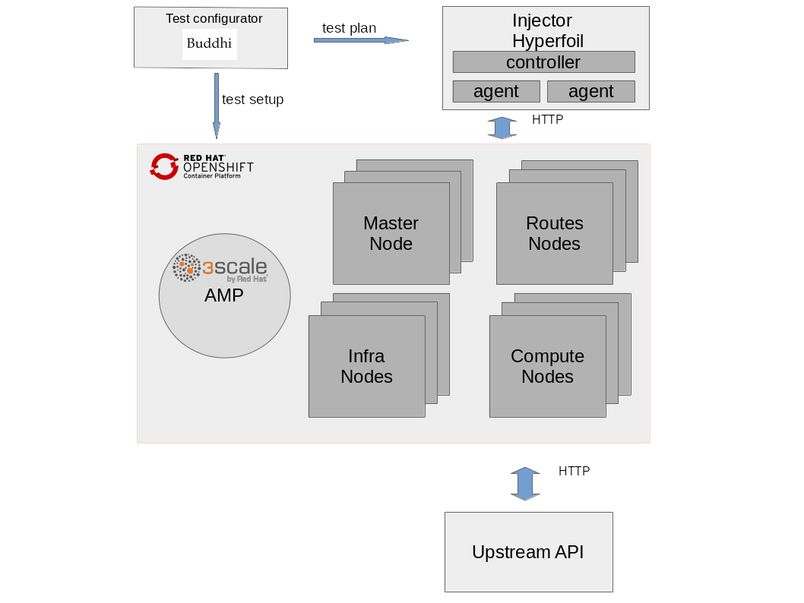

# perftest-toolkit

[](https://quay.io/repository/3scale/perftest-toolkit)

This repo has tools and deployment configs for a performance testing environment to be able to run performance tests of a 3scale API Management solution, focussing on the traffic intensive parts of the solution (the API Gateway and the Service Management API).

We have open sourced it to enable partners, customers and support engineers to run their own performance tests on "self-managed" (i.e. Not SaaS) installations of the 3scale API Management solution.

By running performance test with the same tools, scripts, traffic patterns and measurements as we at 3scale do, we hope it will help produce results that can be more easily compared with the results we achieve in our regular in-house performance testing and that we can run internally.

The goal is to help to resolve doubts or issues related to scalability or performance more quickly and easily - allowing you to achieve the high levels of low-latency performance we strive for and ensure in our own internal testing.

## Table of Contents

* [High level overview](#high-level-overview)
* [Deploy injector](#deploy-injector)
   * [Common settings](#common-settings)
   * [Test your 3scale services](#test-your-3scale-services)
   * [Setup traffic profiles](#setup-traffic-profiles)
* [Run tests](#run-tests)
* [Troubleshooting](#troubleshooting)
   * [Check apicast gateway configuration](#check-apicast-gateway-configuration)
   * [Check backend listener traffic](#check-backend-listener-traffic)
   * [Check upstream service traffic](#check-upstream-service-traffic)
* [Sustained load](#sustained-load)

Generated using [github-markdown-toc](https://github.com/ekalinin/github-markdown-toc)

## High level overview

High level overview is quite simple. Main components are represented in the diagram below.

* Injector: Source of HTTP/HTTPS traffic requests
* Openshift Container Platform with 3scale installed
* Upstream API: Also named as backend API, this is the final API service as an HTTP traffic endpoint. Optionally, for testing purposes, [deploy Upstream API](deployment/doc/deploy-upstream-api.md).
* Test Configurator (Buddhi): 3scale setup and traffic generation tool



## Deploy injector

There are **two** ways of running your tests and the injector has to be configured accordingly.

* [Test your own 3scale services](#test-your-3scale-services): The injector will be custom configured to use your 3scale products (a.k.a. services).

* [Setup traffic profiles](#setup-traffic-profiles): Configure your performance tests to use synthetically generated traffic based on traffic models.

**Requirements**:

Control node:
* ansible >= 2.3.1.0

Managed node host:
* Docker >= 1.12
* python >= 2.6
* docker-py >= 1.7.0

Make sure that the injector host’s hardware resources is not the performance tests bottleneck. Enough cpu, memory and network resources should be available.

### Common settings

** HTTP/HTTPS **

By default, the injector will generate HTTPS traffic on the port number 443.
You can change this setting editing *injector_hyperfoil_target_protocol* and *injector_hyperfoil_target_port* parameters.

```
File: group_vars/all.yml

injector_hyperfoil_target_protocol: https
injector_hyperfoil_target_port: 443
```

Install the injector Ansible Galaxy roles on the Ansible Control node:

```bash
ansible-galaxy install hyperfoil.hyperfoil_setup,0.8.0
ansible-galaxy install hyperfoil.hyperfoil_shutdown,0.8.0
ansible-galaxy install hyperfoil.hyperfoil_test,0.8.0
```

### Test your 3scale services

**Steps**:

**1.** Configure the *ansible_host* parameter by replacing **myinjectorhost.addr.com** with the host IP address/DNS name of the host where you want to install the injector controller component. For example:

```
File: hosts

[hyperfoil_controller]
myinjectorhost.addr.com ansible_hostname=myinjectorhost.addr.com ansible_host=myinjectorhost.addr.com ansible_role=root

[hyperfoil_agent]
myinjectoragenthost.addr.com ansible_host=myinjectoragenthost.addr.com ansible_hostname=myinjectoragenthost.addr.com ansible_role=root
```

More than one injector agent can be configured. Useful when the injector becomes a bottleneck. For example to configure two agents:

```
File: hosts
[hyperfoil_agent]
myinjectoragenthost.addr.com ansible_host=myinjectoragenthost.addr.com ansible_hostname=myinjectoragenthost.addr.com ansible_role=root
myinjectoragenthost02.addr.com ansible_host=myinjectoragenthost02.addr.com ansible_hostname=myinjectoragenthost02.addr.com ansible_role=root
```

**2.** Configure the following settings in `roles/user-traffic-reader/defaults/main.yml` file:
* `threescale_portal_endpoint`: 3scale portal endpoint
* `threescale_services`: Select the 3scale services you want to use for the tests. Leave it empty to use them all.

```
File: roles/user-traffic-reader/defaults/main.yml

# URI that includes your password and portal endpoint in the following format: <schema>://<password>@<admin-portal-domain>.
# The <password> can be either the provider key or an access token for the 3scale Account Management API.
# <admin-portal-domain> is the URL used to log into the admin portal.
# Example: https://access-token@account-admin.3scale.net
threescale_portal_endpoint: <THREESCALE_PORTAL_ENDPOINT>

# Comma separated list of services (Id's or system names)
# If empty, all available services will be used
threescale_services: ""
```

Injector host’s hardware resources should not be performance tests bottleneck. Enough cpu, memory and network resources should be available.
There are two injector services. The controller has one instance. The agent(s) may have 1 or many. 

**3.** Execute the playbook `injector.yml` to deploy injector.

```bash
cd deployment/
ansible-playbook -i hosts injector.yml
```

Managed node host:
* Docker >= 1.12
* python >= 2.6
* docker-py >= 1.7.0
* ansible >= 2.3.1.0


### Setup traffic profiles

**Steps**:

**1.** Edit the *ansible_host* parameter by replacing **<injector_host>** with the host IP address/DNS name of the host where you want to install the injector component. For example:

**2.** Configure the following settings in `roles/profiled-traffic-generator/defaults/main.yml` file:
* `threescale_portal_endpoint`: 3scale portal endpoint
* `traffic_profile`: Currently [available profiles](buddhi/README.md#profiles): `simple, backend, standard`
* `private_base_url`: Private Base URL used for the tests. Make sure your private application behaves like an echo api service.

```
File: roles/traffic-configurator/defaults/main.yml

# URI that includes your password and portal endpoint in the following format: <schema>://<password>@<admin-portal-domain>.
# The <password> can be either the provider key or an access token for the 3scale Account Management API.
# <admin-portal-domain> is the URL used to log into the admin portal.
# Example: https://access-token@account-admin.3scale.net
threescale_portal_endpoint: <THREESCALE_PORTAL_ENDPOINT>

# Used traffic for performance testing is not real traffic.
# It is synthetically generated traffic based on traffic models.
# Information about available traffic profiles (or test plans) can be found here:
# https://github.com/3scale/perftest-toolkit/blob/master/buddhi/README.md#profiles
# Currently available profiles: [ simple | backend | standard ]
traffic_profile: <TRAFFIC_PROFILE>

# Private Base URL
# Make sure your private application behaves like an echo api service
# example: https://echo-api.3scale.net:443
private_base_url: <PRIVATE_BASE_URL>
```

**3.** Execute the playbook `profiled-injector.yml` to deploy injector.

```bash
ansible-playbook -i hosts profiled-injector.yml

```

## Run tests

**1.** Configure users per run-phase parameters:

```
File: group_vars/all.yml

RPS: Maximum requests per second to send
DURATION: Duration of the performance test in seconds
THREADS: Number of parallel threads to use
```

**2.** Run tests

```bash
usage: ansible-playbook -i hosts -i benchmarks/3scale.csv run.yml
```

The test results of the last execution are automatically stored in **/opt/3scale-perftest/reports**.
This directory can be fetched and then the **report/index-<runid>.html** can be opened to view the results.

## Troubleshooting

Sometimes, even though all deployment commands run successfully, performance traffic may be broken.
This might be due to a misconfiguration in any stage of the deployment process.
When performance HTTP traffic response codes are not as expected, i.e. **200 OK**,
there are few checks that can be very handy to find out configuration mistakes.

### Check apicast gateway configuration

First, scale down *apicast-production* service to just one pod.

Monitor pod's logs for traffic accesslog.

```bash
oc logs -f apicast-production-X-podId
```

[Run tests](#run-tests) and check for logs.

Check response codes on accesslog.

If accesslog shows *could not find service for host* error, then the configured virtual hosts do not match traffic *Host* header. For example:
```
2018/06/05 13:32:41 [warn] 25#25: *883 [lua] errors.lua:43: get_upstream(): could not find service for host: 9ccd143c-dbe4-471c-9bce-41df7dde8d99.benchmark.perftest.3sca.net, client: 10.130.4.1, server: _, request: "GET /855aaf5c-a199-4145-a3ab-ea9402cc35db/some-request?user_key=32313d20d99780a5 HTTP/1.1", host: "9ccd143c-dbe4-471c-9bce-41df7dde8d99.benchmark.perftest.3sca.net"
```
Another issue might be when response codes are *404 Not Found*.Then proxy-rules do not match traffic path.

In anyone of the previous cases, it seems that *apicast gateway* does not have latest configuration.
Pods restart is required or wait until process fetches new configuration based on
*APICAST_CONFIGURATION_CACHE* apicast configuration parameter.

Restart is easily done downscaling to 0 and then scaling back to desired number of pods.

```bash
$ oc scale dc apicast-production --replicas=0
$ oc scale dc apicast-production --replicas=2
```

### Check backend listener traffic

First, scale down *backend-listener* service to just one pod.

Monitor pod's logs for traffic accesslog.

```bash
oc logs -f backend-listener-X-podId
```

[Run tests](#run-tests) and check for logs.

If no logs are shown, check [gateway troubleshooting section](#check-apicast-gateway-configuration)

If logs are shown, check response codes on accesslog. Other than *200 OK* means
- *redis* is down,
- *redis* address is misconfigured in *backend-listener*
- redis does not have required data to authenticate requests

### Check upstream service traffic

When *backend-listener* accesslog shows requests are being answered with *200 OK* response codes,
the last usual suspect is upstream or upstream configuration.

Check *upstream* uri is correctly configured in your 3scale configuration

## Sustained load

Some performance test are looking for *peak* and *sustained* traffic maximum performance.
*Sustained* traffic is defined as traffic load where *Job Queue* size is always at low levels, or even empty.
For *sustained* traffic performance benchmark, *Job Queue* must be monitorized.

This is a small guideline to monitor *Job Queue* size:

- Get backend redis pod

```bash
$ oc get pods | grep redis
backend-redis-2-nkrkk         1/1       Running   0          14d
```

- Get Job Queue size

```bash
$ oc rsh backend-redis-2-nkrkk /bin/sh -i -c 'redis-cli -n 1 llen resque:queue:priority'
(integer) 0
```
